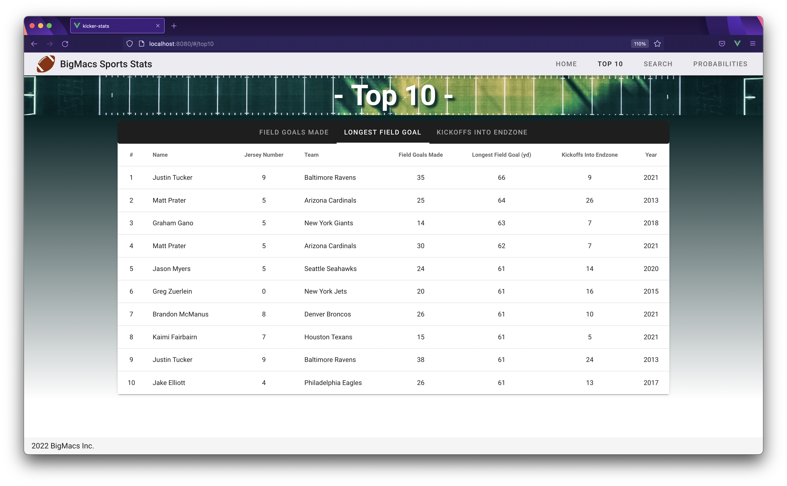
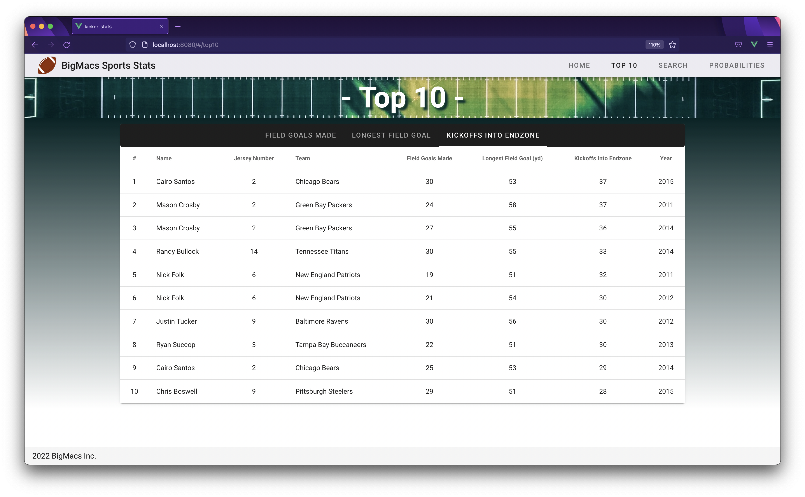

# NFL Kicker Statistics


The goal of this project was to create a website using Vue/Vuetify with database or API calls integrated as well. Specifically, we chose to make a website that interacted with a database of NFL kicker statistics. The website is split into three main pages: Top 10, Search, and Probabilities.

## The Database

The database is static with data from the 2021-2022 NFL season. We explored using an API to gather our data, but this was unsuccessful because the best free API would not work when running locally. This led us to use the API to populate our own database and use Go to make calls to the database. 

There are three main tables in the database: Teams, Kickers, and Kicker seasons. These three tables all have keys that reference other tables. The main connections are relating a kicker to a team and a kicker season to a kicker.

To add the data to the database, run "AllQueries.sql" against your database. 

## API Calls

This project uses Go to make calls to the database. To start the API call server, in the directory "kicker-api", run:

```
go run api/kicker-api.go
```

This will start the server and allow the website to make API calls.

## Running the Website

After downloading the project, make sure your working directory is "kicker-stats". Run:

```
npm install
```

After this is done loading, run:

```
npm run serve
```

This will start the website on localhost port 8080 by default (this could change depending on if another process is running on this port). 

After these two steps, the website should be running.

## Pages

### Top 10
This page is split into 3 categories that a kicker could be Top 10 in: Field Goals Made, Longest Field Goal, and Kickoffs into the Endzone:




